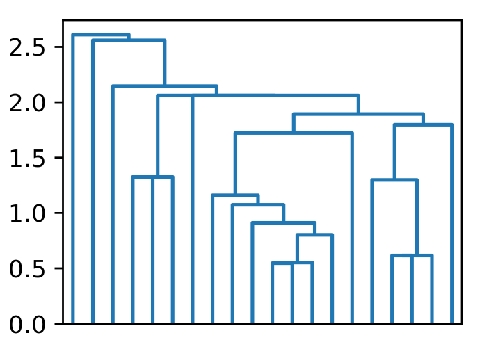

# Overview

This repository hosts a fast parallel implementation for HDBSCAN* [[1]](https://dl.acm.org/doi/10.1145/2733381) (hierarchical DBSCAN). The implementation stems from our parallel algorithms [[2]](https://arxiv.org/pdf/2104.01126.pdf) developed at MIT, and presented at SIGMOD 2021. Our approach is based on generating a well-separated pair decomposition followed by using Kruskal's minimum spanning tree algorithm and bichromatic closest pair computations. We also give a new parallel divide-and-conquer algorithm for computing the dendrogram, which are used in visualizing clusters of different scale that arise for HDBSCAN*.

Our experiments on large real-world and synthetic data sets using a 48-core machine show that our fastest algorithms outperform the best serial algorithms for the problems by 11.13--55.89x, and existing parallel algorithms by at least an order of magnitude.

# Software

This repository hosts the parallel HDBSCAN* implementation of our paper [2]. It is written in C++ with parallelism built-in, and it comes with a Python wrapper to improve the ease of use. It currently supports point data set with dimensionality 2 -- 20. The paper also discusses Euclidean MST, whose code is available [here](https://github.com/wangyiqiu/pargeo.git).

In this implementation, we use a simpler algorithm for the dendrogram, which is different that in the paper. If you are interested in the original research code, please contact the authors.

To start using our software, clone and navigate to the repository:

```
git clone https://github.com/wangyiqiu/hdbscan.git
cd hdbscan
```

# Dendencies

The software runs on any modern x86-based multicore machines. To compile, it requires g++ 5.4.0 or later. The build system is [CMake](https://cmake.org/install/). 

The parallel scheduler that we use is from the [parlaylib](https://github.com/cmuparlay/parlaylib) developed at CMU. The Python binding uses [pybind11](https://github.com/pybind/pybind11). Both packages are included in the repository as submodules -- initialize them before compiling the program:

```
git submodule init
git submodule update
```

The rest of the dependencies are needed to run our Python example (to generate the data set, and visualize the dendrogram). Our Python bindings are written for Python 3, and is tested on Python 3.8.5. Install the dependencies in `pybindings/requirements.txt` by:

```
pip3 install -r pybindings/requirements.txt
```

# Tutorial

### Compilation

From the project root directory:

```
mkdir build
cd build
cmake ..
make -j # this will take a while
cd ..
```

### Option 1: Run the binary

To run the program as using the compiled binary, do the following. The terminal output will show the output of the program, and the total time taken. The output of the binary can be customized by editing `src/hdbscanTime.cpp`, which contains the `main` function, and the HDBSCAN* API is available in `include/hdbscan.h`. The binary parses point data set from disk, which needs to be a CSV file similar to the `example-data.csv` that we provide as example. Starting from the project root directory:

```
cd build/src
./hdbscan -m 5 ../../example-data.csv
```

### Option 2: Use the Python binding

To perform data analytics tasks, we recommend using the Python binding. Please install the Python dependencies mentioned earlier, then starting from the project root directory:

```
cd build/pybindings
cp ../../pybindings/example.py .
python3 example.py
```

The file [pybindings/example.py](https://github.com/wangyiqiu/hdbscan/blob/main/pybindings/example.py) contains a full usage example. The Python call returns a dendrogram, which can be visualized using the [scipy.cluster.hierarchy.dendrogram](https://docs.scipy.org/doc/scipy/reference/generated/scipy.cluster.hierarchy.dendrogram.html#scipy.cluster.hierarchy.dendrogram) of Scipy. While working seamlessly with common packages, our HDBSCAN* computation is very fast, and is highly parallel. After successfully running the example above, you will be able to find an example dendrogram plot generated in the same directory:



# References

[1] [Ricardo J. G. B. Campello, Davoud Moulavi, Arthur Zimek, and Jörg Sander. 2015. Hierarchical Density Estimates for Data Clustering, Visualization, and Outlier Detection. ACM Trans. Knowl. Discov. Data 10, 1, Article 5 (July 2015), 51 pages.](https://dl.acm.org/doi/10.1145/2733381)

[2] [Yiqiu Wang, Shangdi Yu, Yan Gu, and Julian Shun. 2021. Fast Parallel Algorithms for Euclidean Minimum Spanning Tree and Hierarchical Spatial Clustering. In Proceedings of the 2021 International Conference on Management of Data (SIGMOD/PODS '21). Association for Computing Machinery, New York, NY, USA, 1982–1995.](https://dl.acm.org/doi/10.1145/3448016.3457296)
